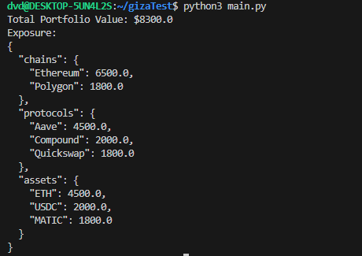

# Portfolio Management System

Este proyecto implementa un sistema para trackear posiciones DeFi de múltiples wallets en distintas cadenas (Chain). Está inspirado en herramientas como DeBank o Zapper, pero se centra en la lógica principal de:

- **Almacenar transacciones** (deposit, withdraw, etc.).
- **Calcular Posiciones** (cantidad total, costo base, P&L).
- **Obtener el valor total** de una cartera.
- **Generar exposición** por cadena, protocolo y activo.

## Características Principales

### Múltiples Wallets
- Cada wallet pertenece a una cadena específica (Ethereum, Polygon, etc.).

### Transacciones
- Incluyen: `timestamp`, `chain`, `protocol`, `action`, `asset`, `amount`, `usd_value`.

### Posiciones
- Cada wallet mantiene un diccionario de `Position` (uno por activo).
- Al depositar, se incrementa la cantidad y el costo base.
- Al retirar, se reduce la cantidad de forma proporcional.

### Cálculos de Valor
- `get_total_value(current_prices)` retorna la suma del valor de todas las wallets.
- `get_portfolio_analytics(current_prices)` genera un desglose por chain, protocol y asset.

## Estructura

- **Transaction**: Representa una sola transacción DeFi.
- **Position**: Gestiona la cantidad y costo base de un activo.
- **Wallet**: Agrupa transacciones y posiciones para una sola dirección (`address`).
- **Portfolio**: Maneja múltiples wallets y expone métodos de cálculo global.

## Ejemplo de Uso

```python
from datetime import datetime

# 1) Crear el Portfolio
portfolio = Portfolio()

# 2) Añadir wallets
portfolio.add_wallet("0x123", Chain.ETHEREUM)
portfolio.add_wallet("0x456", Chain.POLYGON)

# 3) Procesar transacciones
portfolio.process_transaction(
    "0x123",
    Transaction(
        timestamp=datetime.now(),
        chain=Chain.ETHEREUM,
        protocol="Aave",
        action=Action.DEPOSIT,
        asset="ETH",
        amount=1.5,
        usd_value=4500,
    )
)

portfolio.process_transaction(
    "0x456",
    Transaction(
        timestamp=datetime.now(),
        chain=Chain.POLYGON,
        protocol="Quickswap",
        action=Action.DEPOSIT,
        asset="MATIC",
        amount=1000,
        usd_value=1500,
    )
)

portfolio.process_transaction(
    "0x123",
    Transaction(
        timestamp=datetime.now(),
        chain=Chain.ETHEREUM,
        protocol="Compound",
        action=Action.DEPOSIT,
        asset="USDC",
        amount=2000,
        usd_value=2000,
    )
)

# 4) Precios actuales (simulados)
current_prices = {
    "ETH": 3000,
    "MATIC": 1.8,
    "USDC": 1.0
}

# 5) Cálculo de valor total y exposición
total_value = portfolio.get_total_value(current_prices)
exposure = portfolio.get_portfolio_analytics(current_prices)

print(f"Total Portfolio Value: ${total_value}")
print("Exposure:")
print(json.dumps(exposure, indent=2))

```
## RESULTADO ESPERADO

